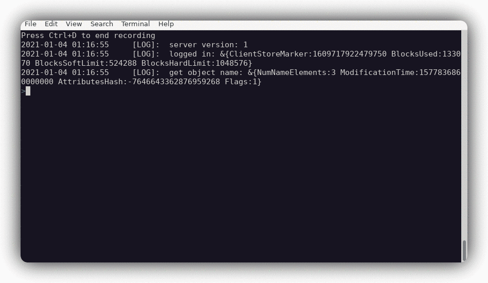

# BoxBackup Query

BoxBackup command line client written in Go.

This reference implementation is using a Go library for interacting with
BoxBackup servers, allowing other client implementations - such as
[Fuse](https://github.com/bazil/fuse) or a Web frontend.

## Screenshot



## Features

- User friendly output of file listings as a table. (Uses
  [simpletable](https://github.com/alexeyco/simpletable)).

- Full tab completion on directories, file names and numeric identifiers. (Uses
  [go-prompt](https://github.com/c-bata/go-prompt))

- Regular expressions for matching files with `ls` or `dir` commands.

- Piping of fetched file data into shell commands - quickly view files with
  `less` or view archive contents.

- All read-only operations are implemented in the library. Working on
  read-write ones.

- Library implementation is done as Go
  [os.FileInfo](https://golang.org/pkg/os/#FileInfo) interface, simplifying
  integration into existing codebases.

- Go implementation supports easy building on all supported Go platforms
  (Linux/Windows/Mac).

## Installation

Download the source and build with Go:

`go build -o ./bbq github.com/karinushka/bbq`

Alternatively build for other supported platforms:

`GOOS=windows GOARCH=amd64 go build -o ./bbq github.com/karinushka/bbq`

`GOOS=darwin GOARCH=amd64 go build -o ./bbq github.com/karinushka/bbq`


## Usage

```sh
# ./bbq --help

Usage of ./bbq:
  -config string
        Main configuration file. (default "/etc/boxbackup/bbackupd.conf")
  -tlshost string
        Verify remote host certificate against this name.
  -verbose
        Increase logging output.

```
